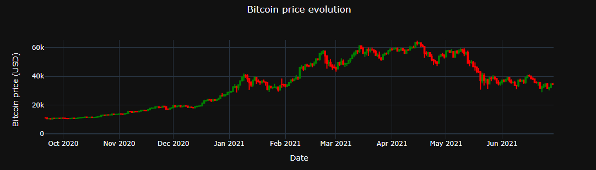

## Cryptocurrency Price Prediction 

### Project Overview
* Used a Convolutional Neural Network and an LSTM with an SGD optimizer to produce a Bitcoin Price Forecasting model.
* Visualized and scale data.
* Built a windowed and batched dataset for training.
* Optimized using learning rate scheduler and SGD/Adam optimizers.

(Notebook capture)

### Code and Resources Used 
**Python Version:** 3.7  
**Packages:** pandas, numpy, matplotlib, seaborn, plotly, sklearn, tensorflow, keras.

### Dataset
The dataset contains the Bitcoin historical price information since 2013 represented by 10 features. The original data is taken from coinmarketcap (https://coinmarketcap.com/).  
Dataset: https://www.kaggle.com/datasets/sudalairajkumar/cryptocurrencypricehistory

### Data preparation
A Time Series with the Bitcoin Close price was built, scaled, and divided in train (20%) and test (80%) sets and then used to construct a 7 days windowed dataframe divided in 75 batches (32,7) shaped with it's correspondant (32,) label tensor each one. 

### Models Building and Performance
DNN and an LSTM Models were tuned using schedulers and SGD/Adam optimizers to find the accurate learning rates.

*	**CNN**: MAE=0.05.
*	**LSTM**: MAE=0.08.

### Metrics Chosen 
**MSE** was used for the loss and **MAE**  for the models output.

---